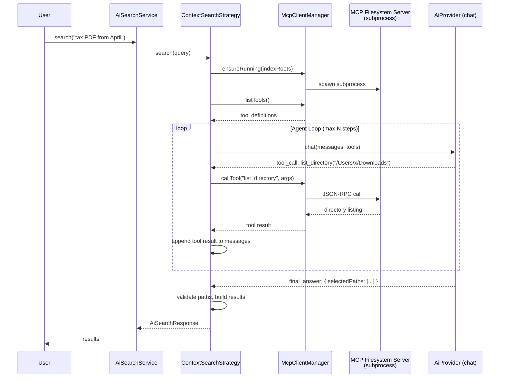

# Plan: Agentic MCP Search Strategy (Replaces Context Strategy)

> [!IMPORTANT]
> This plan replaces the current static "context" strategy (which dumps a file-tree snapshot into a single prompt) with an **agentic multi-step strategy** where the LLM dynamically browses the filesystem via the official [`@modelcontextprotocol/server-filesystem`](https://github.com/modelcontextprotocol/servers/tree/main/src/filesystem) MCP server, spawned as a bundled subprocess.

---

## 1. What Changes

| Component | Before (Context Strategy) | After (Agentic MCP Strategy) |
|---|---|---|
| **LLM interaction** | Single-turn `complete()` call | Multi-turn chat loop with tool calls |
| **File system access** | Static snapshot from local index | Dynamic browsing via MCP tools (`list_directory`, `search_files`, `read_text_file`, etc.) |
| **Scope** | Limited to indexed files within home dir | System-wide, any directory in `indexRoots` |
| **Dependencies** | None extra | `@modelcontextprotocol/server-filesystem`, `@modelcontextprotocol/sdk` |
| **Bundling** | N/A | MCP server runs as internal subprocess via `ELECTRON_RUN_AS_NODE` |

---

## 2. New Dependencies

Add to [package.json](file:///Users/ray2509/Documents/Projects/search/package.json#L19):

```json
{
  "dependencies": {
    "@modelcontextprotocol/server-filesystem": "^0.6.3",
    "@modelcontextprotocol/sdk": "^1.12.1"
  }
}
```

The SDK is used as an MCP **client** inside the Electron main process. The filesystem server is spawned as a subprocess.

---

## 3. Architecture



---

## 4. Design: Extend `AiProvider` for Multi-Turn Chat

The current `AiProvider` only supports single-turn `complete(prompt)` ([AiProvider.ts:16](file:///Users/ray2509/Documents/Projects/search/src/main/services/ai/AiProvider.ts#L16)). Add a `chat()` method for multi-turn tool-calling conversations:

```typescript
// Added to AiProvider.ts

export interface ChatMessage {
  role: 'system' | 'user' | 'assistant' | 'tool';
  content: string;
  /** Tool call ID, required when role is 'tool'. */
  toolCallId?: string;
  /** Tool calls requested by the assistant. */
  toolCalls?: ToolCall[];
}

export interface ToolCall {
  id: string;
  name: string;
  arguments: string; // JSON string
}

export interface ToolDefinition {
  name: string;
  description: string;
  parameters: Record<string, unknown>; // JSON Schema
}

export interface ChatResponse {
  content: string;
  toolCalls: ToolCall[];
  /** True when the model produced a final text answer with no tool calls. */
  done: boolean;
}

export interface AiProvider {
  // ... existing ...
  complete(prompt: string): Promise<string>;

  /** Multi-turn chat with optional tool definitions. */
  chat(messages: ChatMessage[], tools?: ToolDefinition[]): Promise<ChatResponse>;
}
```

### Provider Implementations

#### [GeminiProvider.ts](file:///Users/ray2509/Documents/Projects/search/src/main/services/ai/GeminiProvider.ts)
Gemini's REST API supports function calling via the `tools` field in `generateContent`. The `chat()` method maps `ToolDefinition[]` to Gemini's `functionDeclarations` format and parses `functionCall` responses.

#### [OpenRouterProvider.ts](file:///Users/ray2509/Documents/Projects/search/src/main/services/ai/OpenRouterProvider.ts)
OpenRouter uses the OpenAI-compatible chat completions API. The `chat()` method maps `ToolDefinition[]` to the `tools` array with `type: "function"` entries and parses `tool_calls` from the response.

---

## 5. Design: `McpClientManager`

A new service managing the lifecycle of the MCP filesystem server subprocess and providing a typed client interface.

```typescript
// src/main/services/mcp/McpClientManager.ts

export class McpClientManager {
  private client: Client | null = null;
  private transport: StdioClientTransport | null = null;

  constructor(private readonly settings: SettingsStore) {}

  /** Spawns the MCP server subprocess if not already running. */
  async ensureRunning(): Promise<void>;

  /** Returns MCP tool definitions, converted to ToolDefinition[]. */
  async listTools(): Promise<ToolDefinition[]>;

  /** Executes an MCP tool call and returns the text result. */
  async callTool(name: string, args: Record<string, unknown>): Promise<string>;

  /** Terminates the subprocess. Called on app quit. */
  stop(): void;
}
```

### Subprocess Spawning

```typescript
import { Client } from '@modelcontextprotocol/sdk/client/index.js';
import { StdioClientTransport } from '@modelcontextprotocol/sdk/client/stdio.js';

const serverPath = require.resolve(
  '@modelcontextprotocol/server-filesystem/dist/index.js'
);
const roots = this.settings.get().indexRoots;

this.transport = new StdioClientTransport({
  command: process.execPath,             // Electron binary
  args: [serverPath, ...roots],
  env: { ...process.env, ELECTRON_RUN_AS_NODE: '1' },
});

this.client = new Client({ name: 'lightsearch', version: '0.1.0' });
await this.client.connect(this.transport);
```

### Tool Schema Translation

MCP tools expose JSON Schema via `tools/list`. The manager converts each MCP tool into a `ToolDefinition` compatible with the `AiProvider.chat()` interface:

```typescript
async listTools(): Promise<ToolDefinition[]> {
  const { tools } = await this.client!.listTools();
  return tools.map(t => ({
    name: t.name,
    description: t.description ?? '',
    parameters: t.inputSchema as Record<string, unknown>,
  }));
}
```

### Tool Filtering

Not all MCP filesystem tools should be exposed to the LLM. Only read-only browsing tools are relevant for search:

| MCP Tool | Exposed | Reason |
|---|---|---|
| `list_directory` | Yes | Browse folder contents |
| `search_files` | Yes | Glob/pattern search across directories |
| `read_text_file` | Yes | Read file contents for content matching |
| `get_file_info` | Yes | Check file metadata (size, dates) |
| `directory_tree` | Yes | Get recursive tree view |
| `write_file` | **No** | Dangerous for a search application |
| `edit_file` | **No** | Dangerous for a search application |
| `create_directory` | **No** | Unnecessary for search |
| `move_file` | **No** | Dangerous for a search application |

---

## 6. Design: Refactored `ContextSearchStrategy`

The existing [ContextSearchStrategy](file:///Users/ray2509/Documents/Projects/search/src/main/services/ai/strategies/ContextSearchStrategy.ts) is replaced with the agentic loop. The `FileTreeSnapshot` and `contextPrompts` modules are no longer needed.

```typescript
// src/main/services/ai/strategies/ContextSearchStrategy.ts (rewritten)

export class ContextSearchStrategy implements AiSearchStrategy {
  constructor(
    private readonly index: FileIndex,
    private readonly providers: AiProviderFactory,
    private readonly settings: SettingsStore,
    private readonly mcpClient: McpClientManager,
  ) {}

  async search(query: string): Promise<AiSearchResponse> {
    const provider = this.providers.create();
    const tools = await this.mcpClient.listTools();
    const messages: ChatMessage[] = [
      { role: 'system', content: buildAgentSystemPrompt() },
      { role: 'user', content: query },
    ];

    const maxSteps = this.settings.get().agenticMaxSteps;

    for (let step = 0; step < maxSteps; step++) {
      const response = await provider.chat(messages, tools);

      if (response.done) {
        // Parse final answer JSON from response.content
        return this.buildResponse(response.content, debug);
      }

      // Execute each tool call via MCP
      for (const call of response.toolCalls) {
        const result = await this.mcpClient.callTool(
          call.name,
          JSON.parse(call.arguments),
        );
        messages.push({
          role: 'assistant',
          content: '',
          toolCalls: [call],
        });
        messages.push({
          role: 'tool',
          content: result,
          toolCallId: call.id,
        });
      }
    }

    // Step limit reached
    return this.buildResponse(/* last content */, debug);
  }
}
```

### Agent System Prompt

```typescript
// src/main/services/ai/context/agentPrompts.ts

export function buildAgentSystemPrompt(): string {
  return `You are a desktop file-search assistant. The user will describe files
they are looking for. You have tools to browse the filesystem.

Strategy:
1. Start by listing relevant directories or searching with patterns.
2. Narrow down by reading file metadata or content snippets.
3. When confident, respond with your final answer.

When you have found the files, respond with ONLY a JSON object:
{
  "summary": string,
  "insight": string,
  "selectedPaths": string[]
}

Rules:
- Only return paths you have confirmed exist via the tools.
- Rank by relevance. Maximum 30 paths.
- If no files match, return an empty selectedPaths array.`;
}
```

---

## 7. Settings Changes

In [types.ts](file:///Users/ray2509/Documents/Projects/search/src/shared/types.ts):

```typescript
export interface AppSettings {
  // ... existing ...
  aiSearchStrategy: AiSearchStrategyId;

  /** Max agent steps in context-aware mode (default: 5). */
  agenticMaxSteps: number;
}
```

> [!NOTE]
> The `contextSnapshotTokenBudget` setting is **removed** since the snapshot approach is replaced by dynamic MCP tool browsing.

In [SettingsStore.ts](file:///Users/ray2509/Documents/Projects/search/src/main/services/settings/SettingsStore.ts):

```typescript
export const DEFAULT_SETTINGS: AppSettings = {
  // ... existing ...
  aiSearchStrategy: 'plan',
  agenticMaxSteps: 5,
};

const NUMERIC_BOUNDS = {
  // ... existing ...
  agenticMaxSteps: [1, 15],
};
```

---

## 8. Debug View Updates

The current [AiDebugInfo](file:///Users/ray2509/Documents/Projects/search/src/shared/types.ts#L93-L105) only tracks a single prompt/response pair. For multi-turn agent conversations, extend it:

```typescript
export interface AgentStep {
  role: 'assistant' | 'tool';
  toolName?: string;
  toolArgs?: string;
  content: string;
}

export interface AiDebugInfo {
  // ... existing fields ...

  /** Full conversation log for agentic strategies. */
  agentSteps?: AgentStep[];
  /** Number of LLM round-trips used. */
  stepsUsed?: number;
}
```

---

## 9. Composition Root Changes

In [index.ts](file:///Users/ray2509/Documents/Projects/search/src/main/index.ts):

```typescript
import { McpClientManager } from './services/mcp/McpClientManager';

// In bootstrap():
const mcpClient = new McpClientManager(settings);
const contextStrategy = new ContextSearchStrategy(index, providerFactory, settings, mcpClient);

// In will-quit handler:
app.on('will-quit', () => {
  // ... existing cleanup ...
  mcpClient.stop();
});
```

---

## 10. Files Removed

| File | Reason |
|---|---|
| `src/main/services/ai/context/FileTreeSnapshot.ts` | Replaced by dynamic MCP browsing |
| `src/main/services/ai/context/contextPrompts.ts` | Replaced by `agentPrompts.ts` |

---

## 11. File Changes Summary

| File | Change |
|---|---|
| [package.json](file:///Users/ray2509/Documents/Projects/search/package.json) | Add `@modelcontextprotocol/server-filesystem` and `@modelcontextprotocol/sdk` dependencies |
| [types.ts](file:///Users/ray2509/Documents/Projects/search/src/shared/types.ts) | Add `ChatMessage`, `ToolCall`, `ToolDefinition`, `ChatResponse`, `AgentStep` types. Replace `contextSnapshotTokenBudget` with `agenticMaxSteps`. |
| [AiProvider.ts](file:///Users/ray2509/Documents/Projects/search/src/main/services/ai/AiProvider.ts) | Add `chat()` method to interface, add chat-related types |
| [GeminiProvider.ts](file:///Users/ray2509/Documents/Projects/search/src/main/services/ai/GeminiProvider.ts) | Implement `chat()` using Gemini function calling API |
| [OpenRouterProvider.ts](file:///Users/ray2509/Documents/Projects/search/src/main/services/ai/OpenRouterProvider.ts) | Implement `chat()` using OpenAI-compatible tool calling |
| `src/main/services/mcp/McpClientManager.ts` | **New** -- MCP client lifecycle, tool listing, tool execution |
| `src/main/services/ai/context/agentPrompts.ts` | **New** -- System prompt for agentic search |
| [ContextSearchStrategy.ts](file:///Users/ray2509/Documents/Projects/search/src/main/services/ai/strategies/ContextSearchStrategy.ts) | **Rewritten** -- Multi-step agent loop with MCP tool calls |
| [SettingsStore.ts](file:///Users/ray2509/Documents/Projects/search/src/main/services/settings/SettingsStore.ts) | Replace `contextSnapshotTokenBudget` with `agenticMaxSteps` |
| [index.ts](file:///Users/ray2509/Documents/Projects/search/src/main/index.ts) | Instantiate `McpClientManager`, pass to strategy, add cleanup |
| [index.html](file:///Users/ray2509/Documents/Projects/search/src/renderer/index.html) | Replace "Context token budget" input with "Max agent steps" input |
| [SettingsPanel.ts](file:///Users/ray2509/Documents/Projects/search/src/renderer/src/components/SettingsPanel.ts) | Replace `contextSnapshotTokenBudget` with `agenticMaxSteps` in field lists |
| `src/main/services/ai/context/FileTreeSnapshot.ts` | **Deleted** |
| `src/main/services/ai/context/contextPrompts.ts` | **Deleted** |

---

## 12. New File Structure

```
src/main/services/
├── ai/
│   ├── AiProvider.ts                    # Extended with chat() + types
│   ├── AiProviderFactory.ts             # Unchanged
│   ├── AiSearchService.ts               # Unchanged (facade)
│   ├── GeminiProvider.ts                # + chat() implementation
│   ├── OpenRouterProvider.ts            # + chat() implementation
│   ├── prompts.ts                       # Unchanged (used by PlanSearchStrategy)
│   ├── strategies/
│   │   ├── AiSearchStrategy.ts          # Unchanged
│   │   ├── PlanSearchStrategy.ts        # Unchanged
│   │   └── ContextSearchStrategy.ts     # Rewritten: agentic MCP loop
│   └── context/
│       └── agentPrompts.ts              # New: system prompt for agent
└── mcp/
    └── McpClientManager.ts              # New: MCP subprocess lifecycle + client
```

---

## 13. Implementation Order

1. **Dependencies** -- `npm install @modelcontextprotocol/sdk @modelcontextprotocol/server-filesystem`
2. **Types** -- Add chat/tool types to `types.ts`, replace `contextSnapshotTokenBudget` with `agenticMaxSteps`
3. **AiProvider extension** -- Add `chat()` to interface
4. **GeminiProvider.chat()** -- Implement Gemini function calling
5. **OpenRouterProvider.chat()** -- Implement OpenAI-compatible tool calling
6. **McpClientManager** -- Subprocess spawning, tool listing, tool execution, cleanup
7. **Agent prompt** -- Create `agentPrompts.ts`
8. **Rewrite ContextSearchStrategy** -- Multi-step loop with MCP tool calls
9. **Settings + UI** -- Update defaults, validation, HTML form
10. **Composition root** -- Wire `McpClientManager` into the strategy and cleanup
11. **Delete unused files** -- Remove `FileTreeSnapshot.ts` and `contextPrompts.ts`

> [!WARNING]
> **Privacy**: The agentic strategy sends file names, directory listings, and file content snippets (returned by MCP tools) to the configured LLM provider. The settings UI label for the "context" strategy should clearly communicate this.
